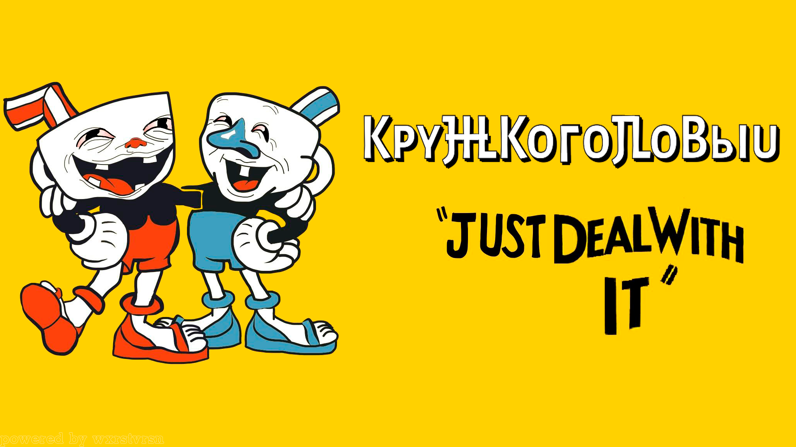

# 🎮 Кружкоголовый


> Краткое описание игры: **TODO**

---


## 📸 Скриншоты


---

## 🚀 Возможности (фичи)

- ✅ Плавное передвижение персонажа
- ✅ Стрельба в движении и на месте
- ✅ Прыжки с анимациями
- ⏳ ```"Искусственный интеллект"``` врагов *(в разработке)*

---

## 🎯 Управление

| Действие | Клавиша |
|----------|---------|
| Движение | ← →     |
| Прыжок   | Z       |
| Стрельба | X       |
| Dash     | Shift   |


---

## 🛠️ Как запустить

1. Установи **Unity 6000.0.42f1** или новее
2. Открой проект через Unity Hub (`Open → путь к папке проекта`)
3. Нажми `Play` в редакторе

---

## 📁 Структура проекта

```plaintext
Assets/
├── Scenes/                 # Сцены игры
├── Scripts/                # Скрипты игрока, врагов и т.п.
├── Art/                    # Спрайты, UI, иконки
├── Materials/              # Материалы для объектов
├── Prefabs/                # Префабы персонажей и окружения
├── Settings/               # Настройки URP, Input System и т.д.
